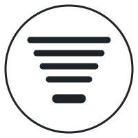
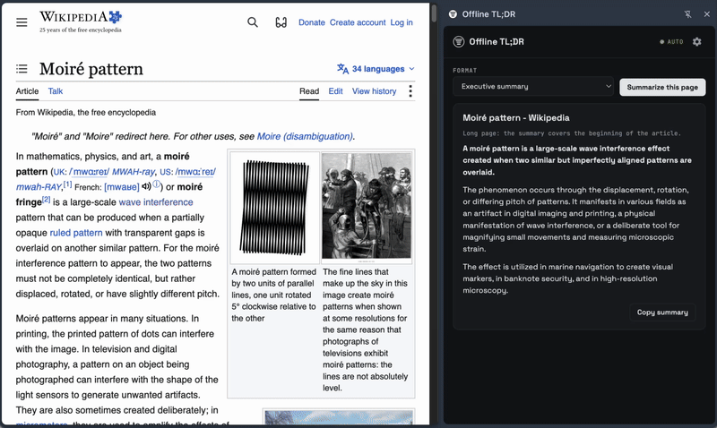
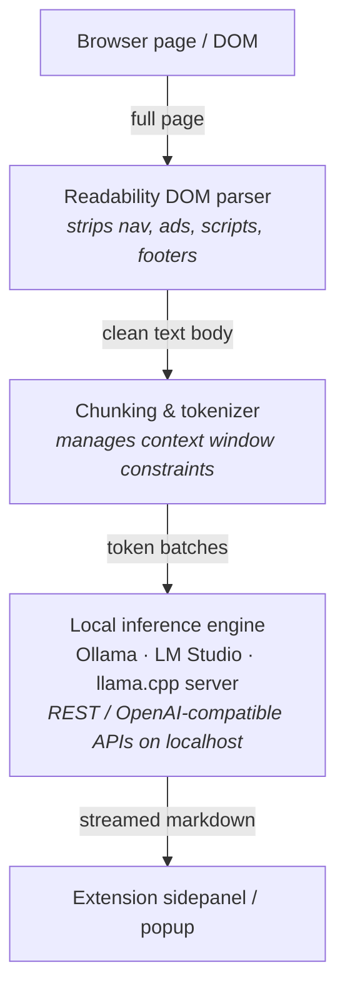

<p align="center">
  
</p>

# Offline TL;DR

**Privacy-first, on-device web content summarization.**

Offline TL;DR is a lightweight, zero-telemetry browser extension that extracts, condenses, and synthesizes web articles, documents, and page content entirely on your local machine.
It talks only to local inference runtimes - Ollama, LM Studio, llama.cpp server, and other localhost endpoints - so your browsing context and text data never touch a cloud server.

<p align="center">
  
</p>

## Why

Summarization is one of the most useful things a model can do while you browse, and one of the worst things to send to a third party.
The page you are reading is your business.
Everything here runs on hardware you control:

- **100% on-device processing.** Zero data transmission, zero logging, zero telemetry.
- **Local backends you already run.** Point the extension at Ollama (`localhost:11434`), LM Studio (`localhost:1234`), a llama.cpp server, or any compatible localhost endpoint.
- **Offline ready.** Fully operational without an internet connection once a model is pulled.
- **Distraction-free extraction.** DOM clutter (sidebars, ads, navigation) is stripped before text reaches the model.
- **Fits your model.** The article budget follows the context length the runtime has loaded (Ollama and LM Studio report it), up to about 160k characters per run; runtimes that do not report one get a conservative default.
- **Your format.** Bullet points, a structured executive summary (bold takeaway, then short paragraphs), or a TL;DR one-liner, with a configurable length cap - plus a small comparison table when the article calls for one.
- **Auto mode.** An optional switch summarizes each page as you browse while the panel is open.
- **Per-tab memory.** Each tab keeps its own summary; switching tabs restores what was summarized there, and a run keeps going if you close the panel.

## How it works



Extraction and chunking are pure logic in `packages/core`, testable against static HTML fixtures without a browser.
The engines are thin HTTP clients in the extension, each implementing the `SummarizationEngine` contract that core defines.
Nothing in any code path sends page content, prompts, or metadata to a remote host; the manifest requests localhost access only.

## Backends

| Backend | Prerequisites | Typical models |
| :--- | :--- | :--- |
| **Ollama** | [Ollama](https://ollama.com) running locally | `llama3.2`, `mistral`, `phi3` |
| **LM Studio** | [LM Studio](https://lmstudio.ai) with its local server enabled | any loaded chat model |
| **llama.cpp** | `llama-server` on a localhost port | any GGUF chat model |

Browser built-in AI (Chrome's on-device model) and pure in-browser Wasm inference (Transformers.js) are candidates for later backends; the localhost runtimes come first.

## Install

- Chrome / Edge: [Offline TL;DR on the Chrome Web Store](https://chromewebstore.google.com/detail/offline-tldr/cgibooiickogggdkhpbmflgookgjpbnl).
- Firefox: not yet listed - build and load it from source below.

Then start a local runtime (see Quick start, step 3) and pick your engine and model in the panel's settings.

## Quick start (developer mode)

1. Build the extension:

   ```sh
   pnpm install
   pnpm build            # dist/chrome + dist/firefox
   ```

2. Load it:
   - Chrome / Edge: open `chrome://extensions`, enable **Developer mode**, click **Load unpacked**, select `dist/chrome`.
   - Firefox: open `about:debugging`, click **Load Temporary Add-on**, select `dist/firefox/manifest.json`.

3. Start a local runtime.
   Ollama must be told to accept browser-extension origins:

   ```sh
   OLLAMA_ORIGINS="chrome-extension://*,moz-extension://*" ollama serve
   ollama pull llama3.2
   ```

   For LM Studio, start the server in the Developer tab; for llama.cpp, run `llama-server -m <model.gguf> --port 8080`.

4. Click the toolbar button to open the panel.
   It detects whether your engine is running (and shows the exact command to start it when it isn't), lists the models your server offers in settings, and summarizes the current page with one click.

## Layout

```
packages/
  core/            # pure logic, no browser APIs: extraction, chunking, engine contract
  extension/
    platform/      # the only files that differ per browser, behind the Platform interface
    background/    # engine configuration, summarization request routing
    content/       # thin: hands the page Document to core's extractor
    panel/         # summary view + settings (sidepanel on Chrome, popup on Firefox)
  shared/          # protocol types only
manifests/         # base.json + chrome.json / firefox.json overlays, merged at build
fixtures/          # static HTML pages core is unit-tested against
scripts/           # esbuild-based build
```

## Commands

```sh
pnpm install
pnpm build            # dist/chrome and dist/firefox
pnpm build:chrome
pnpm build:firefox
pnpm test
pnpm typecheck
```

## License

[MIT](LICENSE)
