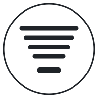
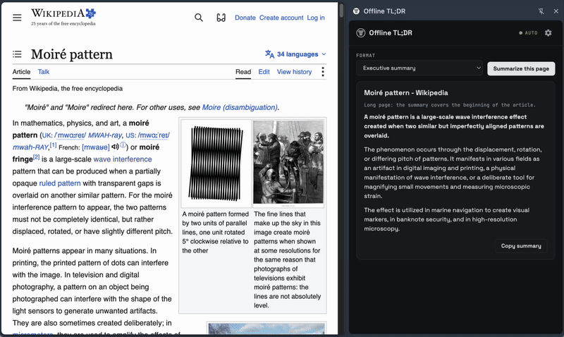
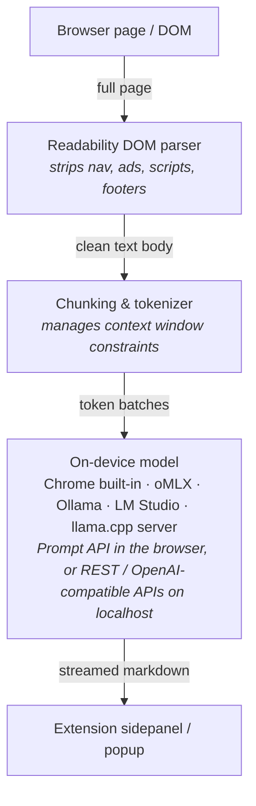

<p align="center">
  
</p>

# Offline TL;DR

**Privacy-first, on-device web content summarization.**

Offline TL;DR is a lightweight, zero-telemetry browser extension that extracts, condenses, and synthesizes web articles, documents, and page content entirely on your local machine.
It talks only to on-device models - Chrome's built-in Gemini Nano, or a local runtime you run: [oMLX](https://omlx.ai), [Ollama](https://ollama.com), [LM Studio](https://lmstudio.ai), llama.cpp server, and other localhost endpoints - so your browsing context and text data never touch a cloud server.

<p align="center">
  
</p>

## Why

Summarization is one of the most useful things a model can do while you browse, and one of the worst things to send to a third party.
The page you are reading is your business.
Everything here runs on hardware you control:

- **100% on-device processing.** Zero data transmission, zero logging, zero telemetry.
- **Works out of the box on Chrome.** Chrome's built-in model (Gemini Nano) is the default: nothing to install or run.
- **Local backends you already run.** Point the extension at oMLX (`127.0.0.1:8000`), Ollama (`localhost:11434`), LM Studio (`localhost:1234`), a llama.cpp server, or any compatible localhost endpoint.
- **Offline ready.** Fully operational without an internet connection once a model is pulled.
- **Distraction-free extraction.** DOM clutter (sidebars, ads, navigation) is stripped before text reaches the model.
- **Fits your model.** The article budget follows the context length the runtime has loaded (Ollama, LM Studio, and oMLX report it), up to about 160k characters per run; runtimes that do not report one get a conservative default.
- **Your format.** Bullet points, a structured executive summary (bold takeaway, then short paragraphs), or a TL;DR one-liner, with a configurable length cap - plus a small comparison table when the article calls for one.
- **Auto mode.** An optional switch summarizes each page as you browse while the panel is open.
- **Per-tab memory.** Each tab keeps its own summary; switching tabs restores what was summarized there, and a run keeps going if you close the panel.

## How it works


```mermaid
flowchart TD
    page[Browser page / DOM]
    extract["Readability DOM parser<br/><i>strips nav, ads, scripts, footers</i>"]
    chunk["Chunking & tokenizer<br/><i>manages context window constraints</i>"]
    engine["On-device model<br/>Chrome built-in · oMLX · Ollama · LM Studio · llama.cpp server<br/><i>Prompt API in the browser, or REST / OpenAI-compatible APIs on localhost</i>"]
    panel[Extension sidepanel / popup]

    page -->|full page| extract
    extract -->|clean text body| chunk
    chunk -->|token batches| engine
    engine -->|streamed markdown| panel
```

Extraction and chunking are pure logic in `packages/core`, testable against static HTML fixtures without a browser.
The engines are thin clients in the extension (two HTTP clients and one over Chrome's Prompt API), each implementing the `SummarizationEngine` contract that core defines.
Nothing in any code path sends page content, prompts, or metadata to a remote host; the manifest requests localhost access only.

## Backends

| Backend | Prerequisites | Typical models |
| :--- | :--- | :--- |
| **Chrome built-in** | Chrome 138 or newer on a desktop that meets Chrome's requirements (see below) | Gemini Nano |
| **Ollama** | [Ollama](https://ollama.com) running locally | `llama3.2`, `mistral`, `phi3` |
| **LM Studio** | [LM Studio](https://lmstudio.ai) with its local server enabled | any loaded chat model |
| **oMLX** | [oMLX](https://omlx.ai) running on a Mac with Apple silicon, plus its API key | any MLX chat model |
| **llama.cpp** | [`llama-server`](https://github.com/ggml-org/llama.cpp) on a localhost port | any GGUF chat model |

Chrome's built-in model is the default on Chrome: nothing to install or run.
Chrome downloads Gemini Nano once (a few GB) when you click **Download model** in the panel's status, and keeps it for every site and extension that uses it.
It needs about 22 GB of free disk space and either a GPU with more than 4 GB of memory or 16 GB of RAM with 4 cores; on a machine below that, the panel says so and you can pick a local server instead.
Its context is small (about 6k tokens), so long pages are cut to what fits; a local server with a bigger context takes more of the page.
Firefox has no built-in model.

### Choosing a local runtime

If you would rather run a model yourself than use Chrome's built-in one, any of these works; pick the one that fits your machine and habits:

- **[oMLX](https://omlx.ai)** - a Mac app that serves models with Apple's MLX framework, made for Apple silicon.
  It manages downloading, loading, and unloading models from its own window, and requires an API key.
- **[Ollama](https://ollama.com)** - a command-line runtime for macOS, Windows, and Linux.
  `ollama pull` fetches a model and the server runs in the background.
- **[LM Studio](https://lmstudio.ai)** - a desktop app for macOS, Windows, and Linux to browse, download, and chat with models, with a local server you switch on.

All three give the extension a list of their models and the context length each one runs with, so long articles use as much of the model as it can take.

Pure in-browser Wasm inference (Transformers.js) is a candidate for a later backend.

## Install

- Chrome / Edge: [Offline TL;DR on the Chrome Web Store](https://chromewebstore.google.com/detail/offline-tldr/cgibooiickogggdkhpbmflgookgjpbnl).
- Firefox: not yet listed - build and load it from source below.

On Chrome, open the panel and click **Download model** the first time.
To use a local runtime instead, start it (see Quick start, step 3) and pick your engine and model in the panel's settings.

## Quick start (developer mode)

1. Build the extension:

   ```sh
   pnpm install
   pnpm build            # dist/chrome + dist/firefox
   ```

2. Load it:
   - Chrome / Edge: open `chrome://extensions`, enable **Developer mode**, click **Load unpacked**, select `dist/chrome`.
   - Firefox: open `about:debugging`, click **Load Temporary Add-on**, select `dist/firefox/manifest.json`.

3. Optionally start a local runtime (on Chrome the built-in model is selected already).
   Ollama must be told to accept browser-extension origins:

   ```sh
   OLLAMA_ORIGINS="chrome-extension://*,moz-extension://*" ollama serve
   ollama pull llama3.2
   ```

   For LM Studio, start the server in the Developer tab; for llama.cpp, run `llama-server -m <model.gguf> --port 8080`.

   For oMLX, start the server from its window (it listens on `http://127.0.0.1:8000`).
   oMLX requires an API key: copy it from oMLX's settings, or from `auth.api_key` in `~/.omlx/settings.json`, and paste it under **API key** in the panel's settings.
   The key stays in the extension's local storage and is sent only to the endpoint you configured.

4. Click the toolbar button to open the panel.
   It detects whether your model is ready (offering the download of Chrome's built-in model, or showing the exact command to start a server when it isn't running), lists the models your server offers in settings, and summarizes the current page with one click.

## Layout

```
packages/
  core/            # pure logic, no browser APIs: extraction, chunking, engine contract
  extension/
    platform/      # the only files that differ per browser, behind the Platform interface
    background/    # engine configuration, summarization request routing
    content/       # thin: hands the page Document to core's extractor
    panel/         # summary view + settings (sidepanel on Chrome, popup on Firefox)
  shared/          # protocol types only
manifests/         # base.json + chrome.json / firefox.json overlays, merged at build
fixtures/          # static HTML pages core is unit-tested against
scripts/           # esbuild-based build
```

## Commands

```sh
pnpm install
pnpm build            # dist/chrome and dist/firefox
pnpm build:chrome
pnpm build:firefox
pnpm test
pnpm typecheck
```

## License

[MIT](LICENSE)
